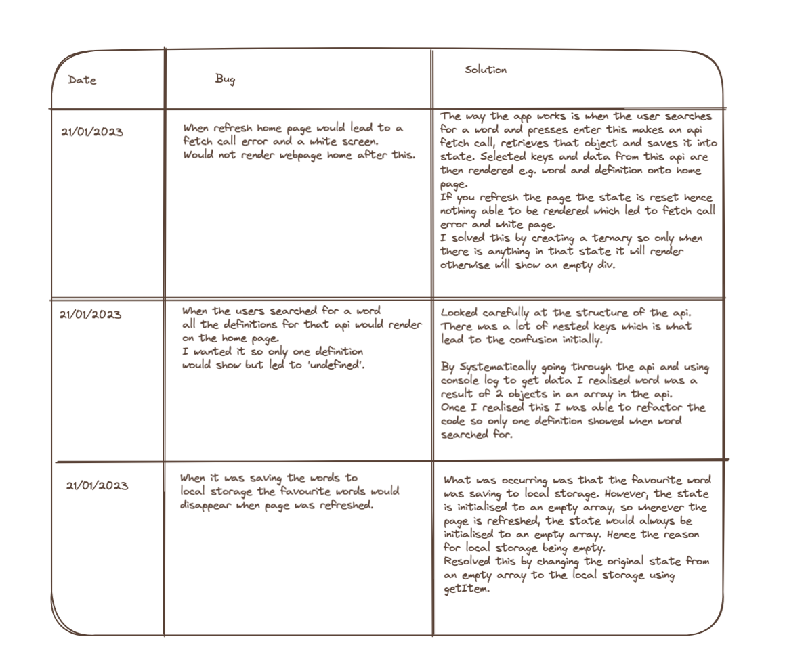

# Word Finder Application

A Javascript React application designed so that the user can search for and save their favourite words and definitions. They can save these to their favourite words and refer to them at a later session. 
Can also listen to the pronunciation of many of the words searched (this is not for all as some of the words do not have an audio file in the API). 

## How to run application

Please make sure to perform the following commands via terminal:

npm install - To install all the dependencies.

npm start - To run the application and enjoy!

npm test - To run the tests in the application.

## Planning

My first task once I had my brief was commence planning. Planning is an integral part to making any well structured application from scratch as it helps improve the user interface, functionality and usability of the application.

### User Client Story

I started off with creating a user client story.

### Wireframes

Then created wireframes.

### Component Hierarchy

Then did a rough component hierarchy diagram.

### Bug table

During the challenge I came across certain bugs and errors. Through reflection and critical thinking I was able to solve these. I kept a log of these in a bug table highlighted below. 

### Chose colour palette

Generated a rough colour palette to use as inspiration for CSS for the application once brief is completed

## CSS

Decided to use the React UI tool mui for the CSS. Website: https://mui.com/

## Testing 

Had a think once main objective was achieved how I could take the application further. 
Decided to use jest and react testing library to start testing component SearchBar.js and Home.js. Currently have written five passing tests as a starting point. 

## Extensions

- Take Testing further by completing testing for SearchBar.js and test all other components in application.
- At the moment application saves favourite word to local storage so that if page is refreshed the user does not lose stored definitions. As an extension I could take the application further by creating a backend. This could be done with either Nodejs or a Java Springboot back end.
- Create an user dashboard that will store saved favourites.
- Create User Profile page.
- Create a quiz that the user can use to test their knowledge on the words and definitions.
- Integrate Auth0 so that authentication is available. With Auth0 have it so the user dashboard only appears in the navbar if they have logged in. Otherwise it will only let the user search for a word. 

